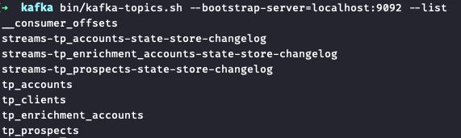

# Spring Cloud Stream - Kafka Streams
Sample project which illustrates how to use Spring Cloud Stream whit Kafka Streams.

References: 
- https://docs.spring.io/spring-cloud-stream/docs/current/reference/html/
- https://cloud.spring.io/spring-cloud-stream-binder-kafka/spring-cloud-stream-binder-kafka.html#_kafka_streams_properties
- https://docs.confluent.io/platform/current/streams/architecture.html

### Kafka Directory
[Download](https://kafka.apache.org/downloads) the latest Kafka release and extract it:
```
$ tar -xzf kafka_2.13-3.2.0.tgz
$ mv kafka_2.13-3.2.0.tgz kafka
$ cd desenvolvimento/kafka
```

### Start Kafka
```
$ bin/zookeeper-server-start.sh config/zookeeper.properties
```
```
$ bin/kafka-server-start.sh config/server.properties
```

### Create Topics
```
$ bin/kafka-topics.sh --create --topic tp_prospects --partitions 4 --bootstrap-server localhost:9092
$ bin/kafka-topics.sh --create --topic tp_accounts --partitions 4 --bootstrap-server localhost:9092
$ bin/kafka-topics.sh --create --topic tp_enrichment_accounts --partitions 4 --bootstrap-server localhost:9092
$ bin/kafka-topics.sh --create --topic tp_clients --partitions 4 --bootstrap-server localhost:9092
```

### Create Changelog Topics
```
$ bin/kafka-topics.sh --create --topic streams-tp_prospects-state-store-changelog --partitions 4 --bootstrap-server localhost:9092
$ bin/kafka-topics.sh --create --topic streams-tp_accounts-state-store-changelog --partitions 4 --bootstrap-server localhost:9092
$ bin/kafka-topics.sh --create --topic streams-tp_enrichment_accounts-state-store-changelog --partitions 4 --bootstrap-server localhost:9092
```

### Message Producer
```
$ bin/kafka-console-producer.sh --topic tp_prospects --bootstrap-server localhost:9092 --property parse.key=true --property key.separator=":"
> 1:{"id": 1, "name": "augusto"}
```
```
$ bin/kafka-console-producer.sh --topic tp_accounts --bootstrap-server localhost:9092 --property parse.key=true --property key.separator=":"
> 1:{"id": 1, "accountNumber": "000.000.000-0"}
```
```
$ bin/kafka-console-producer.sh --topic tp_enrichment_accounts --bootstrap-server localhost:9092 --property parse.key=true --property key.separator=":"
> 1:{"id": 1, "status": "REGULAR"}
```

### Message Consumer
```
$ bin/kafka-console-consumer.sh --topic tp_clients --from-beginning --bootstrap-server localhost:9092  --property parse.key=true --property key.separator=":"
```

## Table-Table Join
Code:


Result:


## State Store
A stateful processor may use one or more state stores. Each task that contains a stateful processor has exclusive access to the state stores in the processor. That means a topology with two state stores and five input partitions will lead to five tasks, and each task will own two state stores resulting in 10 state stores in total for your Kafka Streams application.


Now that we know how Kafka Streams instantiates state stores, let’s have a look into the internals of them. State stores in Kafka Streams are layered in four ways:
1. The outermost layer collects metrics about the operations on the state store and serializes and deserializes the records that are written to and read from the state store.
2. The next layer caches the records. If a record exists in the cache with the same key as a new record, the cache overwrites the existing record with the new record; otherwise, the cache adds a new entry for the new record. The cache is the primary serving area for lookups. If a lookup can’t find a record with a given key in the cache, it is forwarded to the next layer. If this lookup returns an entry, the entry is added to the cache. If the cache exceeds its configured size during a write, the cache evicts the records that have been least recently used and sends new and overwritten records downstream. The caching layer decreases downstream traffic because no updates are sent downstream unless the cache evicts records or is flushed. The cache’s size is configurable. If it is set to zero, the cache is disabled.
3. The changelogging layer sends each record updated in the state store to a topic in Kafka—the state’s changelog topic. The changelog topic is a compacted topic that replicates the data in the local state. Changelogging is needed for fault tolerance, as we will explain below.
4. The innermost layer updates and reads the local state store.

Let’s assume a Kafka Streams application consists of three Kafka Streams clients. While the application executes, one of the Kafka Streams clients crashes. The tasks that the crashed client hosted are redistributed among the two remaining clients. The local states of the crashed client need to be restored on the remaining clients before they can resume processing. However, the remaining clients can’t directly access the local state of the crashed client. Luckily, the changelogging layer sent records to the changelog topic to enable the running clients to restore the local state. This restoration mechanism based on the changelog topic is applied whenever a Kafka Streams client needs to update a local state or needs to create a local state from scratch. In other words, the state’s changelog topic is the single source of truth of a state whereas a state store is a local disposable replica of a partition of the state’s changelog topic that allows you to update and query the state with low latency.

The restoration of a state store is byte based. During restoration, Kafka Streams writes the records from the changelog topic to the local state store without deserializing them. That means the records bypass all layers above the innermost layer during restoration.

The innermost layer of a state store can be any built-in or user-defined state store that implements the state store interface exposed by Kafka Streams. The default state store used in Kafka Streams is RocksDB. Kafka Streams developers initially chose RocksDB because they wanted a write-optimized store. Since RocksDB is the default state store, Kafka Streams provides the means to configure and monitor RocksDB state stores used in a Kafka Streams application.



List of topics containning the change log restoration topics

Reference: 
- https://www.confluent.io/blog/how-to-tune-rocksdb-kafka-streams-state-stores-performance/
- https://spring.io/blog/2019/12/09/stream-processing-with-spring-cloud-stream-and-apache-kafka-streams-part-6-state-stores-and-interactive-queries
- https://docs.spring.io/spring-cloud-stream-binder-kafka/docs/current/reference/html/spring-cloud-stream-binder-kafka.html

## Scalability


## Fault-tolerant processing
Streams and tables are always fault tolerant because their data is stored reliably and durably in Kafka. This should be relatively easy to understand for streams by now as they map to Kafka topics in a straightforward manner. If something breaks while processing a stream, then we just need to re-read the underlying topic again.

For tables, it is more complex because they must maintain additional information—their state—to allow for stateful processing such as joins and aggregations like COUNT() or SUM(). To achieve this while also ensuring high processing performance, tables (through their state stores) are materialized on local disk within a Kafka Streams application instance or a ksqlDB server. But machines and containers can be lost, along with any locally stored data. How can we make tables fault tolerant, too?


Figure 1. Tables and other state are materialized (cached) by stream tasks to local disk inside your Kafka Streams applications or ksqlDB servers.

The answer is that any data stored in a table is also stored remotely in Kafka. Every table has its own change stream for this purpose—a built-in change data capture (CDC) setup, we could say. So if we have a table of account balances by customer, every time an account balance is updated, a corresponding change event will be recorded into the change stream of that table.

Similar to a redo log in a relational database, this change stream is the source of truth for the respective table, and it is continuously and durably stored in a Kafka topic—its so-called changelog topic. This means that fault tolerance is achieved by exploiting the stream-table duality we discussed in the first article of this series. Whatever happens to the stream task or the container/VM/machine it is running on, a table’s data can always be correctly restored from its change stream, via the changelog topic, so that processing can resume without data loss or incorrect processing results.

If a container failure means that our account balances table needs to be rebuilt on another container, then we don’t need to rerun the whole process (i.e., replay all payments and recalculate all balances). We can simply restore the state of the table as it was when the failure happened directly from the changelog topic. Changelog topics are also compacted, so this is a very efficient process as we will see later.


Figure 2. A task runs on machine A. The (partition of the) table it uses is continuously backed up into a Kafka topic. If machine A dies, the task will be migrated to another machine. There, the table will be restored to exactly the state it was when the task stopped on the original machine. Once the restoration is complete, the task will resume processing on machine B.

References: 
- https://www.confluent.io/blog/kafka-streams-tables-part-4-elasticity-fault-tolerance-advanced-concepts
- https://developer.confluent.io/learn-kafka/kafka-streams/stateful-fault-tolerance/